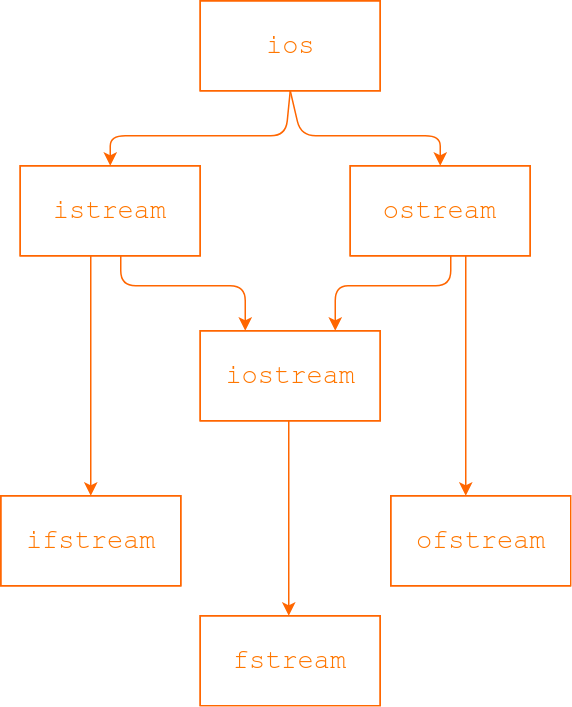

# :file_folder: Файлови потоци. Работа с текстови файлове

## Йерархия на потоците в C++



* istream: Клас, в който е дефиниран оператор >>, както и член-функциите get(), getline(), read().
* ostream: Клас, в който е дефиниран оператор <<, както и член-функциите put(), write().
* iostream: Притежава всички функции както на **istream**, така и на **ostream**.

## Работа с файлове

За да работим с файлови потоци, трябва да включим хедъра `fstream`:

```cpp
#include <fstream>
```

Добра практика е, ако знаете, че ще работите само с поток за вход или изход работите да включите само неговия хедър.

### Писане във файл

```cpp
std::ofstream of_stream;
of_stream.open("filename.txt");

// check successful open
if (!of_stream.is_open())
{
    // handle error
}

of_stream << "I like files\n";
of_stream << "a lot\n";
of_stream << 512;

of_stream.close();
```

### Четене от файл

```cpp
std::ifstream if_stream;
if_stream.open("filename.txt");

// check successful open
if (!if_stream.is_open())
{
    // handle error
}

const int buffer_size = 1024;
char line[buffer_size];
while (if_stream.getline(line, buffer_size))
{
    std::cout << line << "\n";
}

if_stream.close();
```

### Режим на отваряне

При отваряне на файл, можем да изберем **mode** (режим) на работа, комбинирайки следните флагове:

| Флаг        | Значение                                                                               |
| --- | --- |
| **`ios::in`**     | Отваряне с операции за вход                                                            |
| **`ios::out`**    | Отваряне с операции за изход                                                           |
| **`ios::binary`** | Отваряне в двоичен режим                                                               |
| **`ios::ate`**    | **Първоначално** поставя позицията на указателя края на файла                                                    |
| **`ios::app`**    | **Всички** изходни операции се извършват **на края** на файла без да се изтриват досегашните данни. |
| **`ios::trunc`**  | При отваряне за изходни операции за съществуващ файл – досегашните данни се изтриват   |

Флаговете се комбинират с побитово OR и се дават като втори аргумент на `open()`.

🔴 Важно

* `ios::in` флагът е винаги вдигнат при отваряне на поток за вход
* `ios::out` флагът е винаги вдигнат при отваряне на поток за изход

### Примери

```cpp
// ios::out винаги е вдигнат
of_stream.open(file_name);

// еквивалентно на първия open()
of_stream.open(file_name, std::ios::out);

// отваряне в двоичен режим на изходни операции,
// поставяйки указателя в края на файла
of_stream.open(file_name, std::ios::binary | std::ios::ate);

// отваряне с изходни операции, изтривайки
// съдържанието на файла
of_stream.open(file_name, std::ios::trunc);
```

### Състояние на потока

Подобно на флалговете за режим на работа с файл, можем да разберем състоянието на потока чрез флаговете:

| Флаг | Значение |
| --- | --- |
| **`ios::eofbit`** | Достигнат е краят на файла |
| **`ios::failbit`** | Логическа грешка |
| **`ios::badbit`** | Грешка при четене/писане, която е навредила на потока |
| **`ios::goodbit`** | Няма грешки |

### Управление на указателя за четене/писане

* [`tellg()`](http://www.cplusplus.com/reference/istream/istream/tellg/) – връща текущата позиция на `get` указателя
* [`tellp()`](http://www.cplusplus.com/reference/ostream/ostream/tellp/) – връща текущата позиция на `put` указателя
* [`seekg()`](https://www.cplusplus.com/reference/istream/istream/seekg/) – променя текущата позиция на `get` указателя
* [`seekp()`](https://www.cplusplus.com/reference/ostream/ostream/seekp/) – променя текущата позиция на `put` указателя

```cpp
file.seekg(10, std::ios::beg);
int posGet = file.tellg();
file.seekp(10, std::ios::beg);
int posPut = file.tellp();
```

## Задачи

**За задачите е позволено използването на std::string.**

**Зад. 1.** Да се намери големината на файл.

**Зад. 2.** Да се напише програма, която разпечатва собствения си код.

**По желание - за бонус** Да се напише функция, която по подаден файл, създава нов файл с име "corrected", замествайки всички срещания на дадена дума с друга. Приемете, че думата която ще заменяме е с дължина по-голяма от думата, с която ще я заменим.

**Зад. 3.** Направете софтуер за управление на магазин за обувки, в който могат да се предлагат най-много определен брой модели обувки.

Данните, които ни интересуват за един модел обувки, са:

* производител(низ)
* модел(низ)
* цена(double)
* рейтинг(double)
* брой чифтове в склада

Да се реализират следните функции/методи:

* голяма четворка, но вместо конструктор по подразбиране направете конструктор който приема естествено число - максималния брой модели обувки, които могат да се намират в склада.
* добавяне на нов модел обувки с начално количество (ако такъв вече има, да се хвърли грешка)
* продаване на чифт от даден модел (ако няма такъв, да се хвърли грешка. Ако това е последния чифт, модела да се премахне от магазина)
* добавяне на количество от даден модел (ако няма такъв, да се хвърли грешка)
* промяна на рейтинга на даден модел
* премахване на даден модел
* четене на информацията за склада от файл (текущите данни се изтриват и се заместват с новите, прочетени от файла)
* записване на информацията за склада във файл (вие избирате последователността и начина по-който да са записани данните)
* бонус: сортиране на моделите по:
  * среден рейтинг
  * брой продадени

<details>
<summary>Препоръки:</summary>
Записвайте данните в текстов файл, всяка данна на нов ред с оператори >> и <<.
Има два варианта за списъка с обувките:  
1.    може да ползвате Shoe** arr = new Shoe*[max_size]. Всеки указател в масива да сочи към точно един обект при нужда или nullptr  
2.    просто Shoe* arr = new Shoe[max_size]. но така се заделя памет за излишни обекти...
</details>
