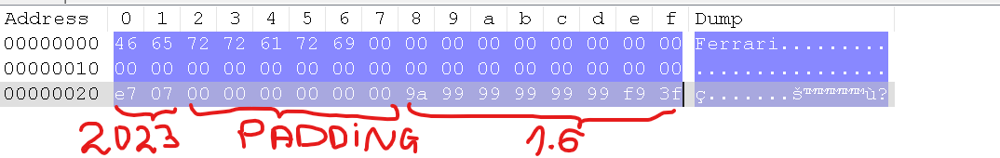

# Двоични файлове

Разликата между текстови и двоични файлове е, че в текстовите файлове се съхраняват само символи, а в двоичните файлове се съхраняват и други неща, като числа, структури и т.н. Всички файлове, които се създават от програми, са двоични. Предимството на двоичните файлове е, че са по-ефективни, но са по-трудни за четене и редактиране от човек. Двоичните файлове са по-ефективни, защото съдържат само информацията, която е необходима, без никакви допълнителни символи, които се използват за форматиране на текстовите файлове.

Въпреки това, работата с двоични файлове в `C++` е много подобна на работата с текстови.

За работа с файлове включваме библиотеката `fstream`:

```cpp
#include <fstream>
```

## Стъпки за работа с двоични файлове

1. Отваряне на файл
2. Работа с файл
3. Затваряне на файл

:exclamation: Не забравяйте да 'подскажете' на компилатора, че ще работите с двоични файлове, като добавите `std::ios::binary` към режима на отваряне на файла.

```cpp
std::fstream file;
file.open("file.bin", std::ios::binary | std::ios::in | std::ios::out);
```

### Функциите за четене и писане

- `read(char* buffer, std::size_t count)` - чете `count` байта от файла и ги записва в `buffer`
- `write(const char* buffer, std::size_t count)` - записва `count` байта от `buffer` във файла

 :exclamation: Обърнете внимание, че функцията приема `char*`. Ако искаме да запазим променлива от друг вид, ще трябва експлицитно да преобразуваме указателя към тип `char*` (без значение, че указателят не сочи към елементи от тип char). Например:

#### Записване на променлива във файл

```cpp
int x = 5;
file.write((char*)&x, sizeof(x));
```

По този начин казваме - запиши ми `sizeof(x)` байта от паметта, която започва от адреса на `x`. В нашия случай `sizeof(x)` е 4, защото `int` е 4 байта.

#### Четене на променлива от файл

```cpp
int x;
file.read((char*)&x, sizeof(x));
```

### Четене и писане на структури

Както вече споменахме, в двоичните файлове можем да лесно да съхраняваме и структури. За да запишем структура във файл, трябва да я преобразуваме в масив от символи.

#### Писане на структура във файл

```cpp
struct F1Car {
  char name[32];
  int year;
  int wins;
  double engine_capacity;
};
int main() {
  F1Car car = {"Ferrari", 2023, 0, 1.6};
  std::ofstream o_file("car.bin", std::ios::binary);
  if (!o_file.is_open()) {
    std::cout << "Error opening file!\n";
    return 1;
  }
  o_file.write((char*)&car, sizeof(F1Car));
  o_file.close();
  return 0;
}
```



За да прочетем структура от файл, трябва да я прочетем в масив от символи и да я преобразуваме обратно в структура.

#### Четене на структура от файл

```cpp
int main() {
  F1Car car2;
  i_file.read((char*)&car2, sizeof(F1Car));
  i_file.close();
  std::cout << "Name: " << car2.name << "\n"
            << "Year: " << car2.year << "\n"
            << "Wins: " << car2.wins << "\n"
            << "Engine capacity: " << car2.engine_capacity << "\n";
  return 0;
}

```

:bangbang: Важно е да знаем, че при четене на структура от файл, тя трябва да е същата, която е била записана във файла. Ако структурата е различна, ще получим непредвидими резултати.

:bangbang: Важно е структурата да не съдържа никакви указатели (включително динамично заделена памет), защото те ще сочат към непознати места в паметта.

## Задачи за упражнение

### Задача 1

Напишете клас `F1Car`, който да съдържа следните полета:

- `name` - име на колата
- `year` - година на производство
- `wins` - брой победи
- `engine_capacity` - обем на двигателя

Напишете клас `F1Team`, който да съдържа следните полета:

- `name` - име на отбора
- `cars` - масив от `F1Car`-ове с размер 2
- Напишете функция, която записва отбора във файл `team.bin`
- Напишете функция, която зарежда отбора от файл `team.bin`

### Задача 2

Напишете клас `SimpleVector`, който да представлява прост вектор от цели числа. Класът да съдържа следните полета:

- `data` - масив от 10 цели числа
- `size` - текущия размер на масива

Напишете функции, които смятате за необходими за работа с класа.
Предефинирайте операторите:

- събиране `+` - събира два вектора. Събира векторите поелементно. За целта векторите трябва да са с еднакъв размер. Ако не са, да се хвърля изключение.
- изваждане `-` - изваждане на два вектора.
- умноожение `*` - умножава вектора по скалар.
- деление `/` - дели вектора по скалар.

Напишете функции за разпечатване на вектора на екрана. Напишете функция, която записва вектора във файл `vector.bin`. Напишете функция, която зарежда вектора от файл `vector.bin`. Напишете функция, която записва вектора в текстов файл `vector.txt`. Напишете функция, която зарежда вектора от текстов файл `vector.txt`.

**Бонус:**\
Напишете клас `Matrix`, който да представлява матрица от цели числа с ПРОИЗВОЛЕН брой редове и точно 10 колони. Напишете функции, които смятате за необходими за работа с класа. Предефинирайте операторите:

- събиране `+` - събира две матрици. Събира матриците поелементно. За целта матриците трябва да са с еднакъв размер. Ако не са, да се хвърля изключение.
- изваждане `-` - изваждане на две матрици.
