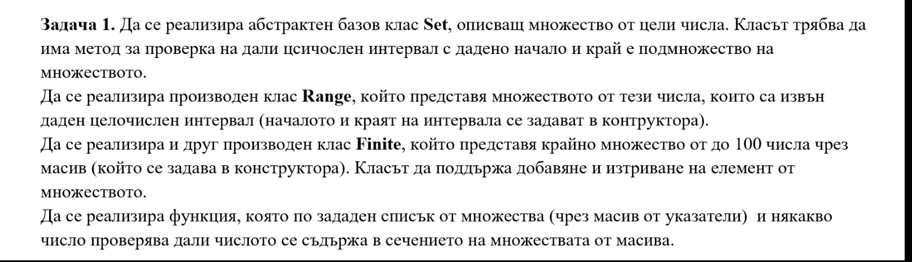
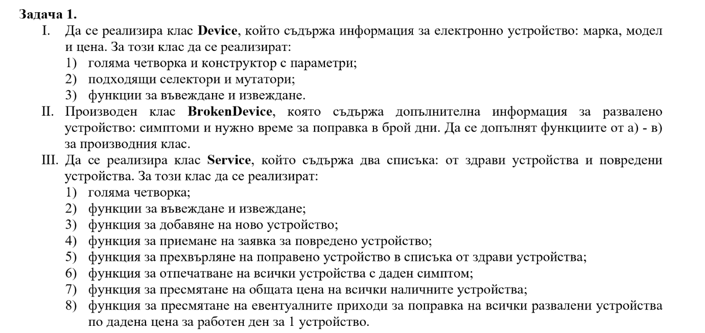

# Подготовка за изпит

## Задача Relations

Позволени са std::string и [std::to_string](https://cplusplus.com/reference/string/to_string/)
  
Да се дефинира шаблонен клас `RelationElement<T>`, който съдържа два обекта от тип Т, наречени `subject` и `object`, и низ `relation`, описващ връзките между тези обекти.  
  
Пример: `RelationElement<int> r1(2,6,"is smaller than")`, `r2(6,3,"is divisible by")`;  
  
Да се реализира функция `print()` за шаблона.  
Да се напише специализация на на шаблона `RelationElement<int>` и реализирайте операция композиция \* по следния начин:

Ако `r = r1*r2`, то  
`r.subject = r1.subject`  
`r.object = r2.obejct`  
`r.relation = r1.relation` `r1.object` *", which is"* `r2.relation`  
  
Пример: `(r1*r2).print()`: 2 is smaller than 6, which is divisible by 3  
  
Композицията се допуска само ако `r1.object == r2.subject`, в противен случай резултатът е r1.  

## Задачи от изпити

За следващите задачи не е позволено ползването на std::vector и std::string. Позволена е библиотеката \<cstring\>

### Задача Множества

Търсената функция да е статична функция към празен клас `SetFunctions`

### Задача Устройства

Всяко устройство трябва да член-данна уникален идентификационен номер

Успех! :four_leaf_clover:
